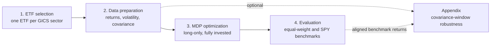
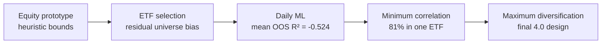

# Maximum Diversification ETF Portfolio

[](https://www.python.org/)
[](https://github.com/idk3088/maximum-diversification-etf-portfolio/actions/workflows/validate.yml)
[](#project-scope)

A reproducible four-stage research pipeline for constructing and evaluating a
long-only sector ETF portfolio with the **Maximum Diversification Portfolio
(MDP)** framework.

The project moves from universe definition and liquidity screening to risk
estimation, constrained optimization, benchmark evaluation, and an optional
covariance-window robustness study.

> **Research use only.** This repository is an educational portfolio project,
> not investment advice or a recommendation to trade.

## Project pipeline



| Stage | What it does | Main output |
|---|---|---|
| 1. ETF selection | Ranks sector ETF candidates by average daily dollar volume | One representative ETF per GICS sector |
| 2. Return and risk preparation | Aligns adjusted prices and estimates annualized volatility and covariance | Validated risk inputs |
| 3. MDP construction | Maximizes the diversification ratio with SLSQP | Long-only portfolio weights |
| 4. Portfolio evaluation | Compares the fixed MDP with equal weight and SPY | Return, risk, drawdown, and correlation metrics |
| Appendix | Repeats the MDP across alternative covariance windows | Sensitivity and weight-stability tables |

## Research journey

The final pipeline is the result of four earlier experiments that exposed
different forms of research-design risk:



The curated [`research-history/`](research-history/) archive preserves the
core code and compact evidence for those negative results. It explains not
only what changed, but why each rejected hypothesis changed the next version.

## Methodology

The diversification ratio is

$$
\mathrm{DR}(w)=\frac{w^\top\sigma}{\sqrt{w^\top\Sigma w}},
$$

where $w$ is the portfolio-weight vector, $\sigma$ is the vector of asset
volatilities, and $\Sigma$ is the covariance matrix. The practical portfolio
is solved subject to

$$
\sum_i w_i=1,\qquad w_i\ge 0.
$$

The optimizer uses equal weights plus reproducible random feasible starting
points, keeps only successful feasible solutions, and selects the one with the
highest diversification ratio.

## Repository structure

```text
.
├── Stage 1 - ETF Selection/
├── Stage 2 - Return and Risk Data Preparation/
├── Stage 3 - Maximum Diversification Portfolio Construction/
├── Stage 4 - Portfolio Evaluation/
├── Appendix A - Covariance Window Robustness Test/
├── docs/
├── requirements.txt
└── README.md
```

Each stage contains its own script, dependency file where needed, and a focused
README. The scripts validate required columns, ticker consistency, finite
values, matrix dimensions, portfolio constraints, and output completeness.

## Quick start

```bash
git clone https://github.com/idk3088/maximum-diversification-etf-portfolio.git
cd maximum-diversification-etf-portfolio
python -m venv .venv
```

Activate the environment, then install the shared dependencies:

```bash
python -m pip install -r requirements.txt
```

Supply your own provider credentials as environment variables. Never commit
them to the repository.

```powershell
$env:TWELVE_DATA_API_KEY = "your_key"
$env:TIINGO_API_TOKEN = "your_token"
```

Run the stages in order from the repository root:

```powershell
python ".\Stage 1 - ETF Selection\scripts\stage1_liquidity_selection.py"
python ".\Stage 2 - Return and Risk Data Preparation\scripts\stage2_return_risk_preparation.py"
python ".\Stage 3 - Maximum Diversification Portfolio Construction\scripts\stage3_mdp_optimization.py"
python ".\Stage 4 - Portfolio Evaluation\scripts\stage4_portfolio_evaluation.py"
python ".\Stage 4 - Portfolio Evaluation\scripts\stage4_rolling_correlation_analysis.py"
```

The optional robustness analysis can be run after Stage 4:

```powershell
python ".\Appendix A - Covariance Window Robustness Test\scripts\appendix_window_robustness_test.py"
```

## Data and reproducibility

Market-data caches and generated numerical outputs are intentionally excluded
from this public-facing edition. Users reproduce them locally with their own
provider accounts and permissions. This keeps API credentials out of version
control and avoids redistributing licensed market data.

- Stage 1 uses the Twelve Data `time_series` API for liquidity screening.
- Stages 2 and 4 use Tiingo adjusted end-of-day prices.
- Stages 3 and the appendix operate only on locally generated upstream files.

See [Data and publication notes](docs/DATA_AND_PUBLICATION.md) before sharing
generated results.

## Project scope

This repository presents the cleaned final pipeline together with curated
historical research snapshots. Virtual environments, caches, temporary test
artifacts, duplicated backups, licensed raw market data, and internal
development documents are intentionally not part of the published codebase.
See [Project history](docs/PROJECT_HISTORY.md) for the organization decision.

## References

- Choueifaty, Y. and Coignard, Y. (2008), *Toward Maximum Diversification*.
- [Tiingo End-of-Day API documentation](https://www.tiingo.com/documentation/end-of-day)
- [Twelve Data API documentation](https://twelvedata.com/docs)
