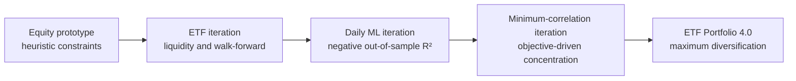

# Research journey

This archive shows how the project changed when earlier assumptions were tested
and rejected. It is organized as a sequence of research decisions, not as a
collection of polished success stories.

## The evolution at a glance

| Iteration | Main question | What improved | What the evidence rejected | Lesson carried forward |
|---|---|---|---|---|
| [1. Equity prototype](01-equity-prototype/) | Can a hand-selected eight-stock portfolio be optimized for several desirable properties? | Walk-forward evaluation and explicit portfolio constraints | The weight bounds and penalty coefficients were discretionary, while the asset universe and full correlation structure were not selected systematically | Improve the research design before adding optimization sophistication |
| [2. ETF liquidity and walk-forward](02-etf-liquidity-walk-forward/) | Can sector ETFs make selection more systematic and investable? | Average dollar volume, eligibility rules, monthly walk-forward evaluation | Point-in-time calculations do not remove bias when the candidate sleeves and classifications are still informed by the present | The universe itself must be point-in-time and historically defensible |
| [3. Daily ML forecasting](03-daily-ml-forecasting/) | Can machine-learning models predict noisy daily ETF returns? | Modular code, purged time-series validation, leakage tests, and multiple model classes | The 30 selected models produced an average out-of-sample R² of **-0.5240** | Model complexity cannot manufacture signal from a weak signal-to-noise setting |
| [4. Minimum-correlation objective](04-minimum-correlation-objective/) | Can portfolio correlation with SPY be minimized directly? | Explicit objective diagnostics, window tests, regularization, and concentration checks | The selected solution held only two ETFs, with **81.01%** in XLE | A correctly solved optimization problem can still be the wrong portfolio problem |
| [5. ETF Portfolio 4.0](../) | Can diversification be defined with a portfolio-level, literature-based objective? | Maximum Diversification Portfolio, long-only implementation, benchmark evaluation, and robustness testing | Current final research design | Objective selection and validation must precede optimizer tuning |

## How each iteration is documented

Each folder answers the same five questions:

1. What was the research hypothesis?
2. What became more rigorous than the prior version?
3. What evidence contradicted the hypothesis or exposed a design weakness?
4. Was the problem caused by implementation, data, validation, or objective choice?
5. What specific lesson changed the next iteration?

This framing is intentional. A negative result is useful when it changes the
next experiment.

## Archive and data policy

The notebooks and scripts are curated historical snapshots. Notebook outputs
were cleared before publication to remove machine-specific paths and bulky
embedded results. The archive does not include virtual environments, caches,
temporary files, API credentials, or duplicated backups.

Raw vendor market data is also excluded. The old local folders contain Yahoo,
Alpha Vantage, Twelve Data, and other cached market files; publishing those
files would add substantial size and may require separate redistribution
permission. The archive therefore keeps code, methodology, and compact
aggregate evidence only.

These historical snapshots are preserved to explain the research process. The
root-level 4.0 pipeline remains the canonical implementation.
